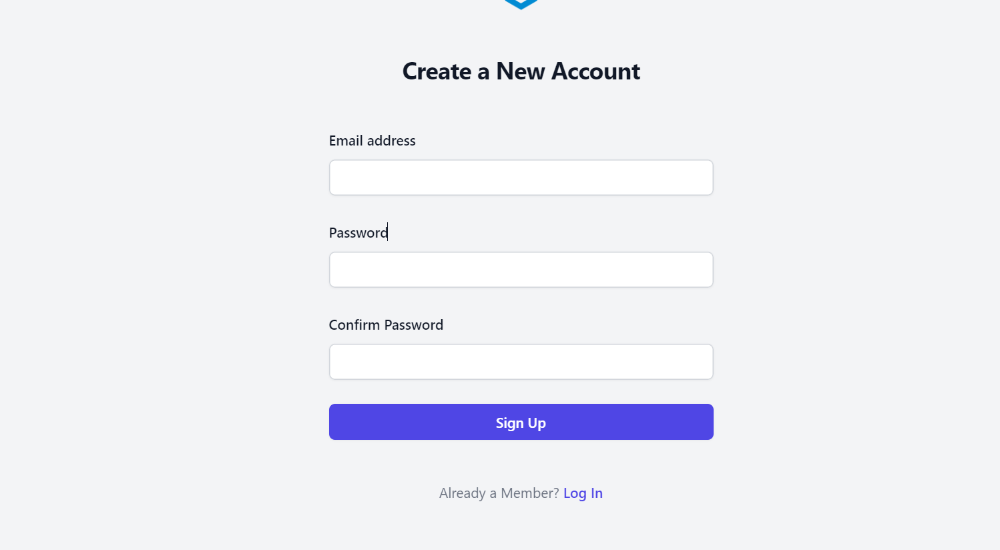
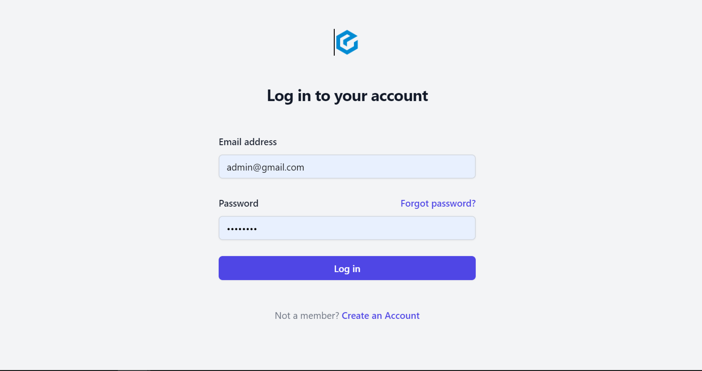
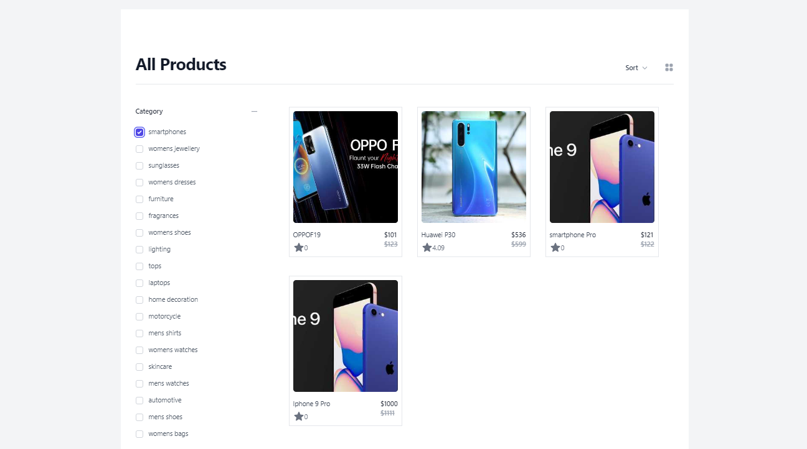
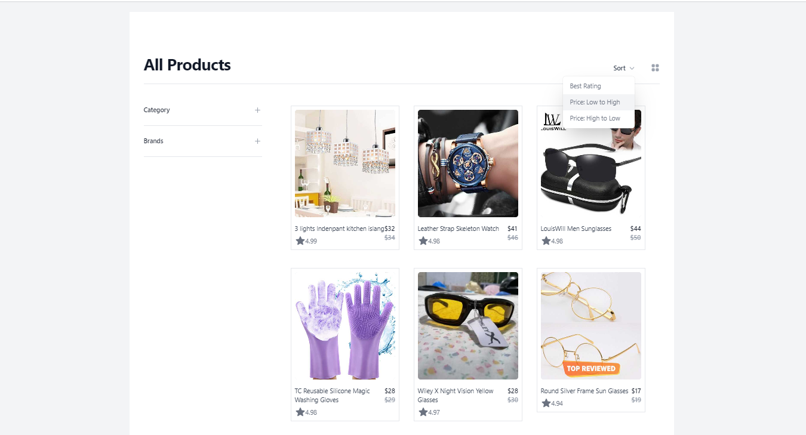
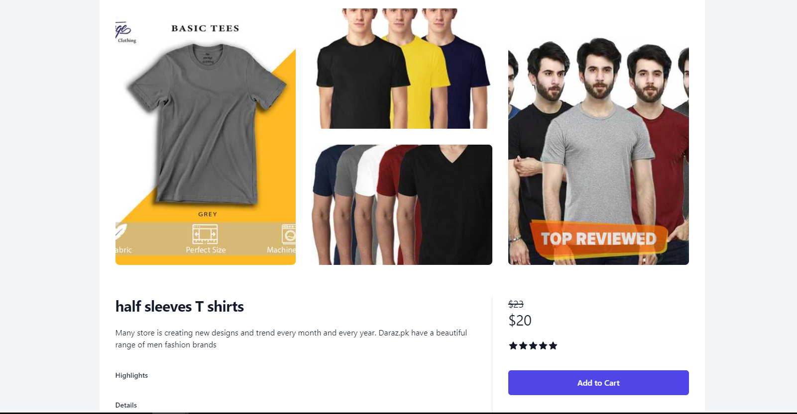
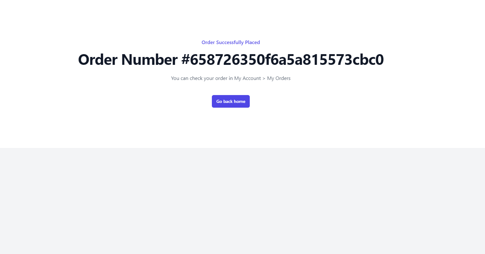
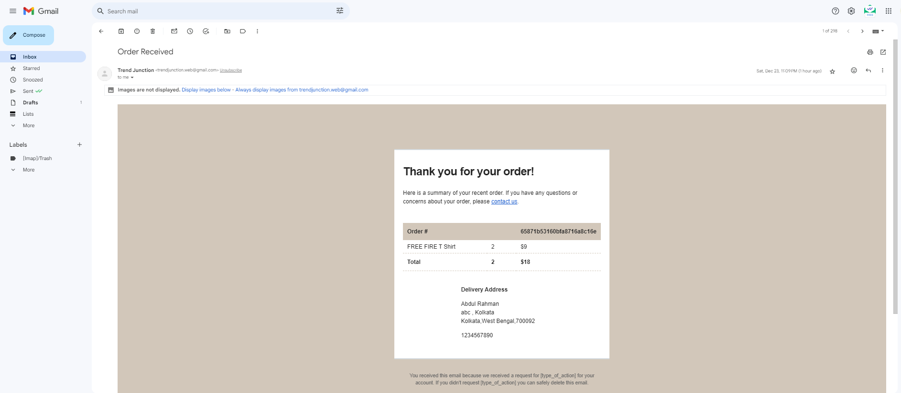

# 🌐 Trend-Junction 

 #### Welcome to our powerful e-commerce platform! This project provides essential features like product listings, cart management, secure checkout, and an admin panel for efficient order and product management. Dive into the world of modern web development with a tech stack that includes React 18, Tailwind CSS, Redux Toolkit, Express, and MongoDB.
 

### User Login

### Admin Login

### Category

### Sort

### Product Details

### Order Details

### Order Mail

# Features 💡
##### Basic E-commerce Features:
##### Product lists, details, cart, and checkout.
##### Secure Card Payments / Cash payments.
##### Admin Panel for Add/Edit Orders and Products.
##### Sorting, Filtering, and Pagination queries using Mongoose.
##### User-friendly Authentication with Passport JS strategies.
##### Order and Reset Password Emails.
##### User Profile and order history.

# 🔥 Technical Details
### Frontend:

######  React 18 with the elegance of Tailwind CSS.
######  Redux Toolkit with Async Thunk for state management.
###### React Router v6 for seamless navigation.
### Backend:

###### Express REST API for robust server-side logic.
######  MongoDB with Mongoose v7 as the Object-Document Mapper (ODM).
### Additional Integrations:

######  JSON-server for front-end testing.
######  MongoDB Atlas cloud database for scalable storage.
######  Vercel for efficient server deployment.
######  Nodemailer for slick email functionality (GMail SMTP).
######  Stripe integration for secure Payments (PaymentIntent custom flow).

## Getting Started 🚀
##### 1. Clone the Repository:
###### git clone https://github.com/87abdul/Trend-Junction.git 
#####  2. Install Dependencies:
###### cd trend-junction
###### npm install
##### 3. Configure Environment Variables:
###### Create a .env file in the root directory and set your environment variables.
##### 4. Run the Application:
###### npm start
# Usage 🖥️
###### Open the application at http://localhost:3000.
###### Access the admin panel at http://localhost:3000/admin.
# Contributing 🤝
Fork the repository and create a new branch: git checkout -b feature/my-feature.
Commit your changes: git commit -m 'Add new feature'.
Push to the branch: git push origin feature/my-feature.
Submit a pull request.
# License 📄
This project is licensed under the [MIT License](https://github.com/87abdul/Trend-Junction/blob/main/LICENSE).

# Acknowledgments 🙌
Feel free to customize this README to make it even more tailored to your project.
